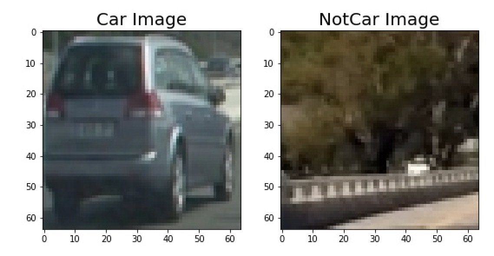
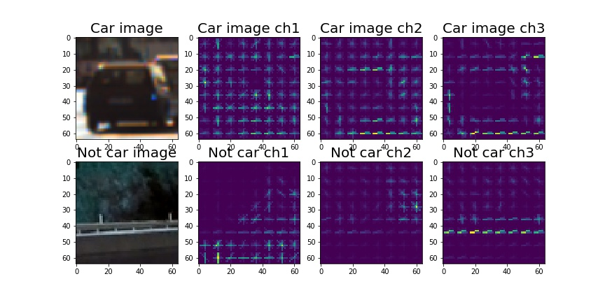
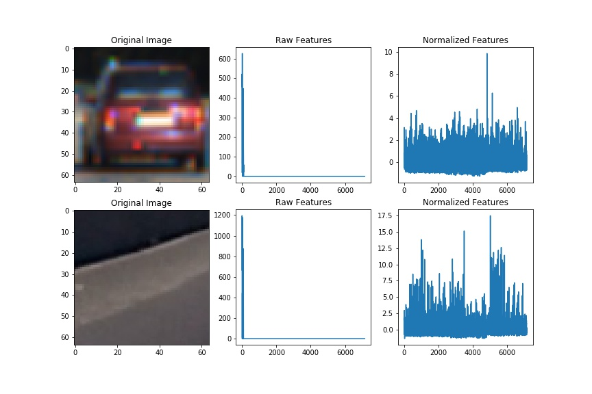
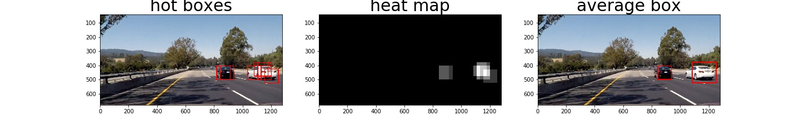

# Vehicle Detection and Tracking

## The goals / steps of this project are the following:
In this project, I’ll use image features to train a linear support vector machine to detect and track vehicles on the lane lines. General steps taken are as follows:

* Apply color transform, binned color features, histograms of color, as well as histogram of oriented gradients (HOG) feature extraction on a labeled training set of images and train a classifier Linear SVM classifier.
* Implement a sliding-window technique and use your trained classifier to search for vehicles in images.
* Run the pipeline on a video stream using heat map to reject outliers and follow detected vehicles.
* Estimate a bounding box for vehicles detected.

---
## Description of the pipeline

### Step 1: Image preprocessing
Total number of images belonging to car and not car are 8792 and 8968 respectively. Since the numbers of both categories are comparable, no further data balancing is performed. An example of the car and not car images are shown as bellow:

---

### Step 2: Feature extraction

I then explored different color spaces and different `skimage.hog()` parameters (`orientations`, `pixels_per_cell`, and `cells_per_block`) to extract features from images. After various iterations, I chose the following parameters for the pipeline:

| Parameters        | Values   | 
|:-------------:|:-------------:| 
| color space     | `HSV`       | 
| orientation     | 12      	|
| pixels_per_cell     | 8      |
| cell_per_block     | 2        |
| histogram bins     | 32        |

Here is an example of the HOG features of images:

---
Combining features from the HOG feature and histograms of color, image features are then normalized using the function `StandardScaler()`. An example of the features before and after normaliztion is shown as below:

---

### Step 3: Model training

I trained a linear SVM using the default parameter values.80% of the data is used as training set with a mix of both catogories and the rest 20% is used as validation set.

### Step 4: Vehicle detection

Sliding window is used to split test images into small patches to extract features and run through the trained model to predict if the patch corresponds to a vehicle image. Sliding window search is performed using the Hog Sub-sampling Window Search with a scale of 1.5 and around the positions from 380px to 670px in height direction and 600px to 1280px in width direction. 

I recorded the positions of positive detections in the image and from the positive detections I created a heatmap and then thresholded that map to identify vehicle positions. I then used `scipy.ndimage.measurements.label()` to identify individual blobs in the heatmap.  I also used the percentage of overlap between two boxes as confidence level of the predicted blob corresponding to a vehicle. I then constructed bounding boxes to cover the area of each blob detected with high probability to be a car.  
  
Here's an example result showing the hotboxes, heatmap and the resulting final bonding box:

---

The pipeline is then applied to the video to on each frame and the box is averaged among previous 10 frames. The results in test_videos_output shows that the pipeline performs reasonably well on the entire project video.Here's a [link to my video result](test_videos_output/project_video.mp4)

## Discussion

The output videos look reasonably well be there are couple of improvements that can be made to improve the performance. 

First improvement can be made at the training stage.Since the total number of training data is only roughly twice as much as the number of feature vectors, the model is very prone to overfitting. Therefore, mode training data, such as data collected by Udacity [here](https://github.com/udacity/self-driving-car/tree/master/annotations). Also, instead of simple linear support vector machine, other methods such as Deep Neuron Networks(DNN) might improve the performance of the training model to avoid false positive.

Another improvement can be made at the vehicle detection stage. In addition to thresholding, other methods such as non maximum suppression can be used to find the position of the bounding box. Furthermore, it can be beneficial to keep track of the position and number of cars when processing video files to reject false positive detections and generate smooth output videos.

